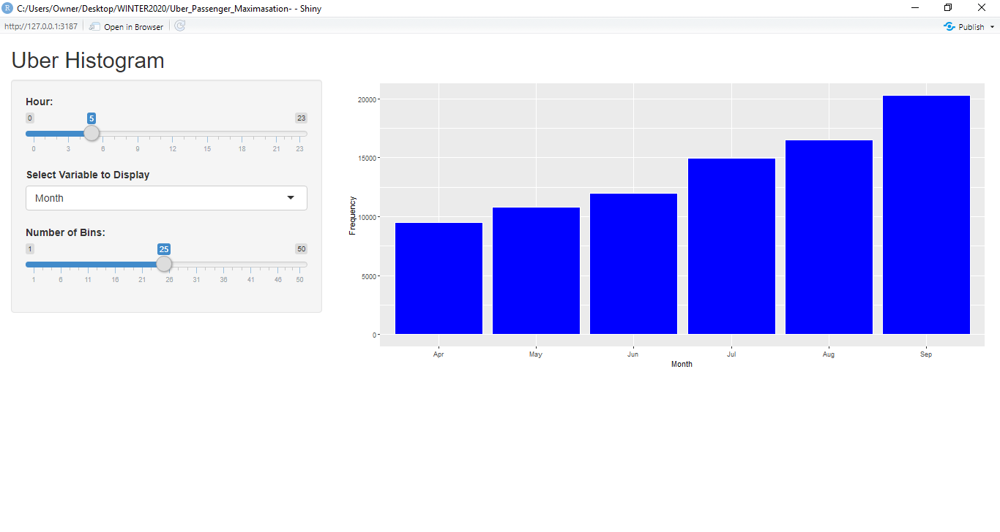

```{r setup, include=FALSE}
knitr::opts_chunk$set(echo = FALSE, message=FALSE, warning=FALSE, fig.height = 4, fig.width = 6 )
```


```{r, include = FALSE, echo = FALSE}
library(tidyverse) 
library(shiny)
library(dplyr)
library(lubridate)
library(leaflet)
library(gmapsdistance)
library(geosphere)
library(shinydashboard)
library(measurements)
library(data.table)
library(revgeo)
library(ggmap)
library(scales)
library(varhandle)


uberdataf <-  read.csv("uber_dataf.csv")

hour_data <- uberdataf %>%
           group_by(hour) %>%
               dplyr::summarize(Total = n()) 
data.table(hour_data)


month_hour <- uberdataf %>%
          group_by(Month, hour) %>%
             dplyr::summarize(Total = n())

month_hour$Month <-factor(month_hour$Month, 
                      levels = c("Apr", "May", "Jun",
                                 "Jul", "Aug", "Sep"))
uberdataf$Dayofweek <-factor(uberdataf$Dayofweek, 
                      levels = c("Sun", "Mon", "Tue",
                                 "Wed", "Thu", "Fri", "Sat"))

uberdataf$Month <-factor(uberdataf$Month, 
                      levels = c("Apr", "May", "Jun",
                                 "Jul", "Aug", "Sep"))
month_weekday <- uberdataf %>%
         group_by(Month, Dayofweek) %>%
             dplyr::summarize(Total = n())

month_weekday$Month <-factor(month_weekday$Month, 
                      levels = c("Apr", "May", "Jun",
                                 "Jul", "Aug", "Sep"))
```


```{r}
ui <- fluidPage(

  # Application title

  titlePanel("Uber Histogram"),

  # Sidebar with a slider input for number of bins 

  sidebarLayout(

    sidebarPanel(

     
         sliderInput("hour",
                     "Hour:",
                     min = 0,
                     max = 23,
                     value = 5,
                     step = 1),

      varSelectInput("variable", 
                     "Select Variable to Display", 

                      data = uberdataf %>% select(Month, Dayofweek)), 

      sliderInput("bins",
                  "Number of Bins:",
                  min = 1,
                  max = 50,
                  value = 25)

    ),   

    # Show a plot of the generated distribution

    mainPanel(

      plotOutput("distPlot")  

 )

  )

)

# Define server logic required to draw a histogram

server <- function(input, output) {

    output$distPlot <- renderPlot({

    # generate bins based on input$bins from ui.R

     hour_input <- input$hour
     var_input <- input$variable
     nbins <- input$bins

      # draw the histogram with the specified number of bins

    ggplot(data = uberdataf %>% filter (hour == hour_input)) + 

      geom_histogram(aes(x = !!input$variable), bins = nbins, color="white", fill="blue", stat = "count")  + xlab (var_input) + ylab("Frequency")

  })

}

# Run the application 

shinyApp(ui = ui, server = server)
```


## Shiny App Discussion


{width=600px}
{width=600px}


When it comes to transporting people (nowadays, perhaps even food) from one location to another, most people usually think of Uber.  In this report, I have tried to analyze the number (or frequency) of Uber trips that customers in New York City took from the months of April to September in the year 2014. 
My interactive shiny app has the option to display two histograms. The first option displays the frequency of Uber trips in each of the months of April to September. Whereas the second option displays the frequency of trips in each of the seven weekdays. Both options allow the user to adjust the time of the day. For the first option, we observe that the frequency of the trips shows an increasing trend across months. This is true for most of the time in a day. This could be explained by two reasons. The first one being that people tend to travel more during the summer as a lot of people who have jobs might ask for vacations. Moreover, most students get a sufficiently long summer break somewhere from the end of May until around the latter half of August. New York City is known to be one of the most famous tourist attractions in not just the US but also the world. So it makes sense for a month to generally have busier hours during a day than the previous month. The second reason has to do with the fact the Uber launched the option of "UberPool", which allows riders to share rides based on proximity in August 2014. We see that the number of Uber trips for September are substantially higher than those for the other months. UberPool is more affordable since the riders have to let go of the privacy that comes with riding alone with the driver. For a lot of people, the money saved is a greater reward than the privacy that comes due to paying more, which might mean that  Uber gained new customers along with previous customers using the app more often.
For the second option, we observe a few interesting results. If we adjust the 'Hour' slider to 7 (meaning 7 a.m.), we see that the number of trips on weekdays Monday to Friday is three times more than that on the weekends. This could be explained by the fact that people primarily have to show up to schools, colleges, and jobs during the daytime and on weekdays. However, if we adjust the 'Hour' slider to 23 (meaning 11 p.m.), we see that more people tend to use Uber on the weekends, which could be explained by people showing up to bars and clubs to partake in the "nightlife" or the "party culture" in NYC. Lastly, if we adjust the slider to 2 (meaning 2 a.m.), we observe that this is the time at which people (especially those who are inebriated) tend to start heading back to their homes after a Friday night (which shows up as Saturday morning) or a Saturday night (which shows up as Sunday morning).
In conclusion, we might say that if an Uber driver in NYC (or in most metropolitan areas in the US) is looking to maximize the number of passengers that ride with them, weekends nights and weekday mornings might give them a good opportunity of doing that.

## Technical Report 

In order to finish this project, I bounced a few ideas off my friends and Professor Sage. At first, I was thinking of merging the Uber dataset with a weather dataset in order to come up with an interactive map that would let Uber drivers know about the number of passengers in different locations of NYC  given a certain temperature, time of the day and day of the week. Most of my time was spent wrangling with the data for both of these datasets. One thing which gave me a hard time, in particular, was importing the temperature values to the uber dataset. I managed to do that using a left_join with and having two ID's from the uber dataset.
However, I changed my idea on the last day since I had difficulty accessing google maps and I didn't already have an account or an API key to access ggmap in R. This occurance, along with the fact, that Professor Sage communicated all of us to not go out of our ways in order to make a shiny app for the final project, caused me to come up with a simple shiny app. My aim was to make it interactive and for it to be easily readable/accessible. 
In order to wrangle my Uber dataset, I used a lot of DateTime formatting and functionality in R. I extracted the time, date, day of week, month, and the year variables just from one "Date.Time" variable. In line with my previous aim, I did the same thing with the weather dataset. However, I ended up not using that at all for my final shiny app. In order to prepare data to be used in my shiny app, I used the functions group_by() and summarise(), which helped me to create more specific data frames that I was able to incorporate in the code for my shiny app. 
At first, I could not make the months or days of the week appear in their correct order in the histogram. They would appear in alphabetical order. This took me quite some time to figure out, however, a quick read of Chapter number 15 from the textbook (that we used for our class) made me realize that I could just factor() those two variables for each of the data frame that I was using to create my shiny app. As we can find out from the summary, this proved helpful for me as it allowed me to recognize patterns and make sense out of those patterns.
Another problem that I faced was the time it took for my Uber dataset to be generated every time I ran the chunk of code Since there were six different CSV files for the six months of data, I used the function rbind() to form one big dataset, and then I used the DateTime functions on that bigger dataset, which just caused RStudio to crash numerous times. This was frustrating to deal with and I believe some valuable time could have been saved if I had a laptop with a faster processing speed than the one I currently have. 
